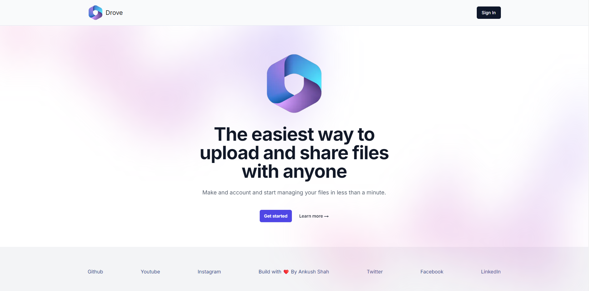

### Drove

Replicates google drive, a widely used file sharing and saving tool. It enables users to securely login & signup, uploading files, create teams and access various functionalities such as group file sharing, saving, managing members and many more.

### Preview



### <a name="table">Table of Contents</a>

1. [Tech Stack](#tech-stack)
2. [Features](#features)
3. [Getting Started](#getting-started)
4. [Feedback](#feedback)
5. [Contributors](#contributors)

### <a name="tech-stack">Tech Stack</a>

- Next.js
- TypeScript
- HTML5
- CSS3
- Node.js
- NPM
- NPX
- Clerk
- Convex
- Tailwind CSS

### <a name="features">Features</a>

- **Authentication**: Implements authentication and authorization features using Clerk, allowing users to securely log in via social sign-on or traditional email and password methods, while ensuring appropriate access levels and permissions within the platform.

- **File Sharing**: Share files and folders with others easily, controlling their access levels (view, comment, or edit)

- **Cloud Storage**: Store files and access them from any device with internet connectivity.

- **Collaboration**: Work simultaneously on documents, spreadsheets, and presentations with real-time editing and commenting.

- **Offline Access**: Access and edit files offline, with changes syncing automatically once reconnected to the internet.

- **File Organization**: Use folders and labels to organize files efficiently.

- **Search Functionality**: Powerful search tools to quickly locate files using keywords, file types, or owner details.

- **Version History**: View and restore previous versions of files to track changes over time.

- **Security Features**: Protect files with encryption and two-factor authentication for added security.

- **Responsive Design**: Follows responsive design principles to ensure optimal user experience across devices, adapting seamlessly to different screen sizes and resolutions.

### <a name="getting-started">Getting Started</a>

### Prerequisites

- [Git](https://git-scm.com/)
- [Node.js](https://nodejs.org/en)
- [npm](https://www.npmjs.com/) (Node Package Manager)

1. **Cloning:** 

    Run the following command in your terminal or command prompt to clone the repository to your local machine:

    ```bash
    git clone https://github.com/theankushshah/drove.git
    ```

2. **Navigate to the Directory:** 
    
    Once cloned, navigate into the project directory using the `cd` command:

    ```bash
    cd drove
    ```

### Download

1. **Download ZIP Code folder:** 

    Unzip the folder in your machine.

2. **Navigate to the Downloaded Directory:** 

    Open your code editor and open the unzipped folder in it then:

    ```bash
    cd /path/to/downloaded/folder
    ```

### Cloning & Download

1. **Dependencies Installation:**

    ```bash
    npm install
    ```

2. **Environment Variables & Database Setup:** 

    Create a new file named `.env` in the root of your project and add the following content:

    ```env
    CONVEX_DEPLOYMENT=
    NEXT_PUBLIC_CONVEX_URL=

    NEXT_PUBLIC_CLERK_PUBLISHABLE_KEY=
    CLERK_SECRET_KEY=
    ```

    Replace the placeholder values with your actual Clerk & convex credentials. You can obtain these credentials by signing up on the [Clerk website](https://clerk.com/) and [Convex website](https://www.convex.dev/)

    Also get you Issuer url by creating a JWT Template on clerk and replace with mine in application.

    Get your hostname from convex too and replace with mine.

    Add CLERK_SECREY_KEY on convex website enviorment variable.

3. **Running:**

    ```bash
    npm run dev
    ```

    Open [http://localhost:3000](http://localhost:3000) in your browser to view the project.

4. **Start Coding:** 

    Feel free to edit the code according to your requirements. 

5. **Testing**

    ```bash
    npm test
    ```

6. **Build for Production**

    ```bash
    npm run build
    ```

### Github

1. **Initialize a New Git Repository:**

    ```bash
    git init
    ```

2. **Stage and Commit the Code:**

    ```bash
    git add .
    git commit -m "Initial commit"
    ```

3. **Create a New Repository on GitHub:**

    Do not initialize the new repository with a README, .gitignore, or license.

4. **Link Local Repository to GitHub:**

    ```bash
    git remote add origin https://github.com/username/new-repo.git
    ```

    Replace https://github.com/username/new-repo.git with your actual repository URL.

5. **Push Code to GitHub:**

    ```bash
    git branch -m main
    git pull origin main
    git push -u origin main
    ```

6. **Deployment:** 
    
    Deploy the application to your preferred hosting platform to make it accessible online.

### Forking

1. **Forking:** 

    Run the following command in your terminal or command prompt to fork the repository to your local machine:

    ```bash
    git clone https://github.com/your-username/drove.git
    ```

2. **Navigate to the Directory:** 

    Once cloned, navigate into the project directory using the `cd` command:

    ```bash
    cd drove
    ```

3. **Start Coding:** 

    Make the additions & desired changes to the code.

4. **Commit & Push Your Changes to Your Fork:** 

    Once cloned, navigate into the project directory using the `cd` command:

    ```bash
    git add .
    git commit -m ""
    git pull origin main
    git push -u origin main
    ```

5. **Create a Pull Request:**

- Go to your forked repository on GitHub
- Click the "Compare & pull request" button.
- Review your changes and write a clear description of your contribution.
- Click "Create pull request"

    **I will review your pull request and decide whether to merge your changes into my repository or not**

### <a name="feedback">Feedback</a>

You might encounter some bugs while using this app. You are more than welcome to contribute. Just submit changes via pull request and I will review them before merging. Make sure you follow community guidelines.

### <a name="contributors">Contributors & Main</a>

- Ankush Shah (ankushsahvlogs@gmail.com)
- Haven Futures (support@havenfutures.com) (Main)

Happy coding!