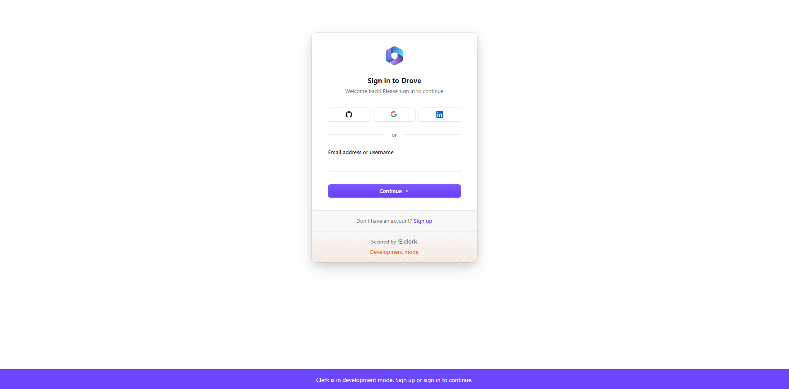
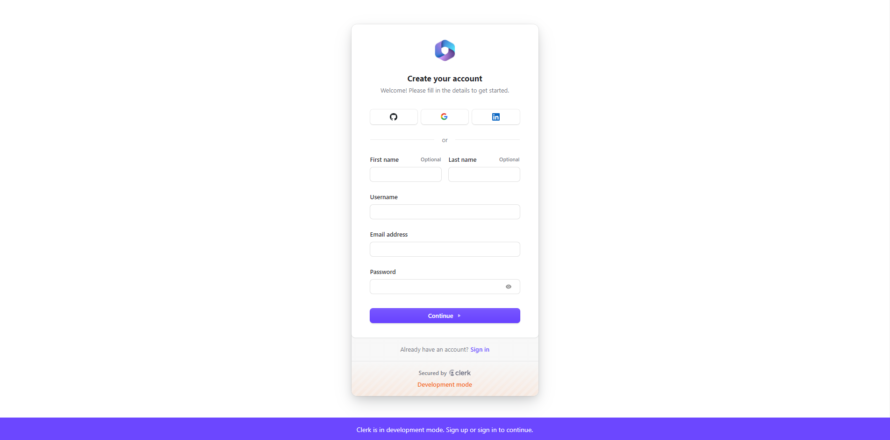
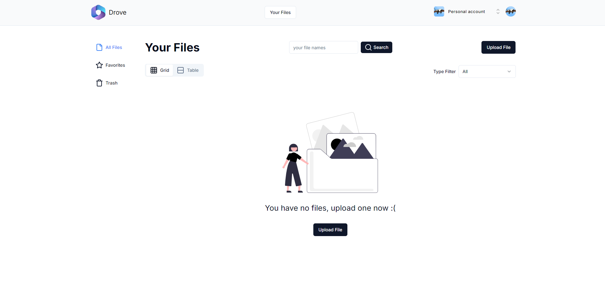
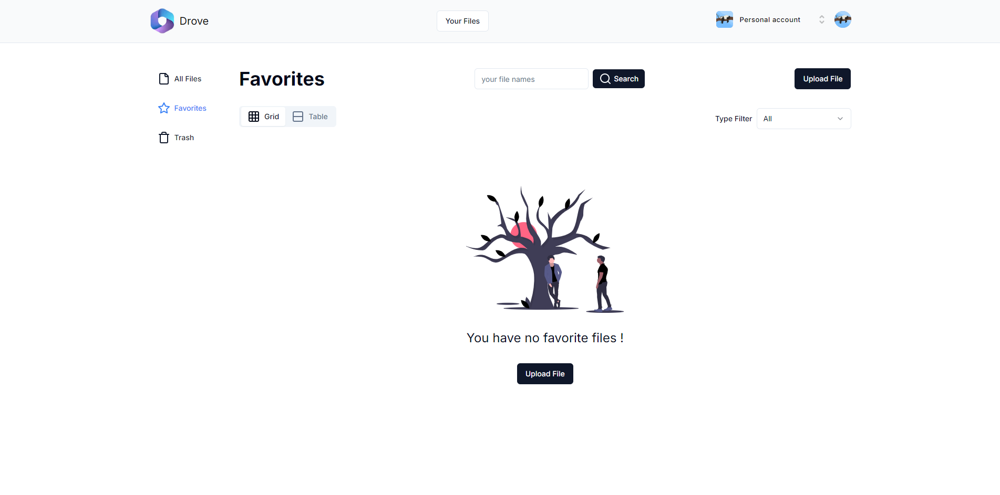
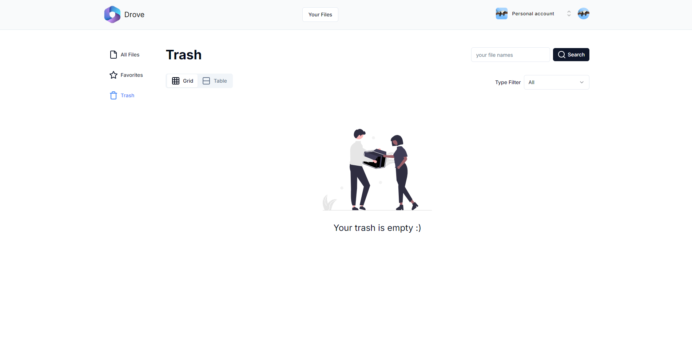

<a name="readme-top"></a>

# Drove - A File Saving & Sharing Platform


## <a name="table">Table of Contents</a>

1. [Introduction](#introduction)
2. [Tech Stack](#tech-stack)
3. [Features](#features)
4. [Getting Started](#getting-started)
5. [Screenshots](#more-screenshots)
6. [Feedback](#feedback)

## <a name="introduction">Introduction</a>

Built with the latest Next.js and TypeScript, this project replicates google drive, a widely used file sharing and saving tool. It enables users to securely log in, uploading files, create teams and access various functionalities such as group file sharing, saving, and managing members.

## <a name="tech-stack">Tech Stack</a>

- Next.js
- TypeScript
- Clerk
- Convex
- shadcn
- Tailwind CSS

## <a name="features">Features</a>

**Authentication**: Implements authentication and authorization features using Clerk, allowing users to securely log in via social sign-on or traditional email and password methods, while ensuring appropriate access levels and permissions within the platform.

**File Sharing**: Share files and folders with others easily, controlling their access levels (view, comment, or edit)

**Cloud Storage**: Store files and access them from any device with internet connectivity.

**Collaboration**: Work simultaneously on documents, spreadsheets, and presentations with real-time editing and commenting.

**Offline Access**: Access and edit files offline, with changes syncing automatically once reconnected to the internet.

**File Organization**: Use folders and labels to organize files efficiently.

**Search Functionality**: Powerful search tools to quickly locate files using keywords, file types, or owner details.

**Version History**: View and restore previous versions of files to track changes over time.

**Security Features**: Protect files with encryption and two-factor authentication for added security.

**Responsive Design**: Follows responsive design principles to ensure optimal user experience across devices, adapting seamlessly to different screen sizes and resolutions.

and many more, including code architecture and reusability. 

## <a name="getting-started">Getting Started</a>

**Make sure you have the following installed on your machine**

- [Git](https://git-scm.com/)
- [Node.js](https://nodejs.org/en)
- [npm](https://www.npmjs.com/) (Node Package Manager)

**Cloning the Repository**

```bash
git clone https://github.com/theankushshah/drove.git
cd drove-clone
```

**Installation**

Install the project dependencies using npm:

```bash
npm install
```

**Set Up Environment Variables**

Create a new file named `.env` in the root of your project and add the following content:

```env
CONVEX_DEPLOYMENT=
NEXT_PUBLIC_CONVEX_URL=

NEXT_PUBLIC_CLERK_PUBLISHABLE_KEY=
CLERK_SECRET_KEY=
```

Replace the placeholder values with your actual Clerk & convex credentials. You can obtain these credentials by signing up on the [Clerk website](https://clerk.com/) and [Convex website](https://www.convex.dev/)

Also get you Issuer url by creating a JWT Template on clerk and replace with mine in application

Get your hostname from convex too and replace with mine

Add CLERK_SECREY_KEY on convex website enviorment variable

**Running the Project**

```bash
npm run dev
```

Open [http://localhost:3000](http://localhost:3000) in your browser to view the project.

## More Screenshots











## Feedback

You might encounter some bugs while using this app. You are more than welcome to contribute. Just submit changes via pull request and I will review them before merging. Make sure you follow community guidelines.

## Developer & Main

- Ankush Shah (ankushsahvlogs@gmail.com) (Main)

Happy coding! 🚀